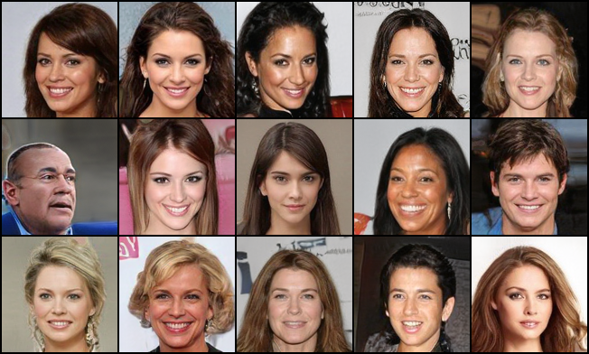
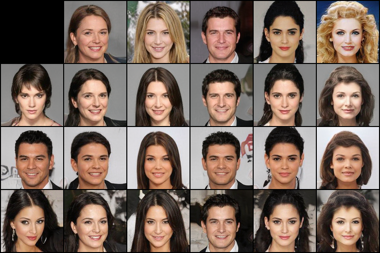

# Style-Based GAN in PyTorch



Implementation of A Style-Based Generator Architecture for Generative Adversarial Networks (https://arxiv.org/abs/1812.04948) in PyTorch

Based on https://github.com/rosinality/style-based-gan-pytorch

## Installation

a. Create a conda virtual environment and activate it.
```
conda create -n fakeface python=3.7 -y
conda activate fakeface
```

b. Install PyTorch and torchvision following the [official instructions](https://pytorch.org/), e.g.,
```
conda install pytorch torchvision cudatoolkit=10.1 -c pytorch
```

c. Download the source code and pip install the requirements.
```
git clone https://github.com/yan-roo/FakeFace.git
pip install -r requirements.txt
```

## Prepare datasets
Download the CelebA dataset. (Default resolution is 178x218)
```
python helper.py
```
Crop the face only. (Remember to uncomment the last [line 269](https://github.com/yan-roo/FakeFace/blob/master/helper.py#L269))
```
python helper.py --width 128 --height 128
```

## Transform to lmdb format
The default progressive training requires image resolution from 8x8 to 128x128.

You can increase or decrease the image size in [line23 & line41](https://github.com/yan-roo/FakeFace/blob/master/prepare_data.py#L23-L41).
```
python prepare_data.py --out data .
```

## Train the model
### Train on CelebA
```
python train.py --mixing data
```
### Train on FFHQ
```
python train.py --mixing --loss r1 --sched --max_size 1024 data
```

### The checkpoint file to resume from
```
python train.py --mixing data --ckpt checkpoint/*.model --phase 1000000
```

## Generate fake face
The generate size setting should be the same as the checkpoint.
```
python generate.py --size 128 --sample 1 --style_mixing 1 checkpoint/*.model
```
Resolution | Model & Optimizer 
-----------|-------------------
128px      | [Link](hhttps://drive.google.com/file/d/1IxDVmZhSqx03b5HmRGqKqcwgItU41PCa/view?usp=sharing)

There still some strange faces and background in the results. 

## Acknowledgements
* [Kim Seonghyeon](https://github.com/rosinality)
* [StyleGAN — Official TensorFlow Implementation](https://github.com/NVlabs/stylegan)
